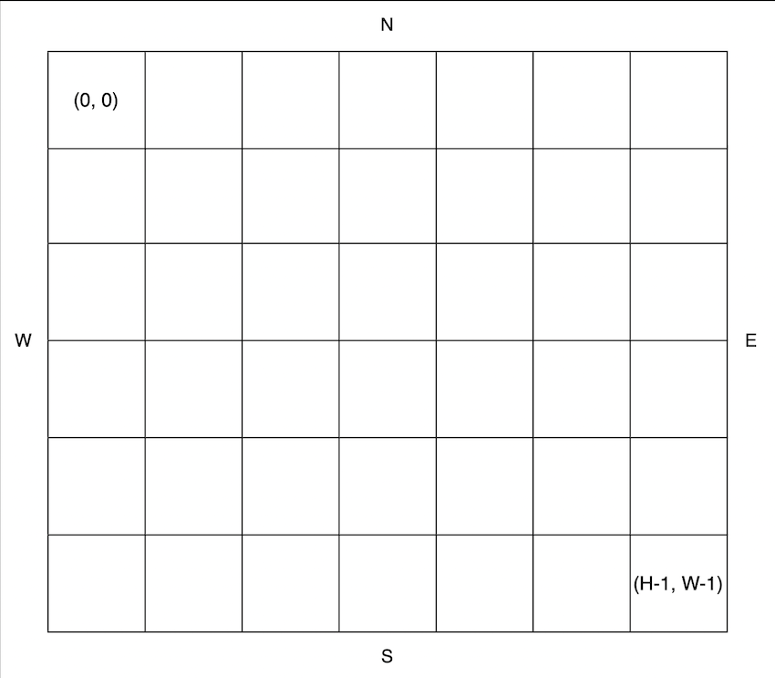

## 1. 문제 정보
문제: 공원 산책
링크: https://school.programmers.co.kr/learn/courses/30/lessons/172928

### 문제
지나다니는 길을 'O', 장애물을 'X'로 나타낸 직사각형 격자 모양의 공원에서 로봇 강아지가 산책을 하려합니다. 산책은 로봇 강아지에 미리 입력된 명령에 따라 진행하며, 명령은 다음과 같은 형식으로 주어집니다.

["방향 거리", "방향 거리" … ]
예를 들어 "E 5"는 로봇 강아지가 현재 위치에서 동쪽으로 5칸 이동했다는 의미입니다. 로봇 강아지는 명령을 수행하기 전에 다음 두 가지를 먼저 확인합니다.

주어진 방향으로 이동할 때 공원을 벗어나는지 확인합니다.
주어진 방향으로 이동 중 장애물을 만나는지 확인합니다.
위 두 가지중 어느 하나라도 해당된다면, 로봇 강아지는 해당 명령을 무시하고 다음 명령을 수행합니다.
공원의 가로 길이가 W, 세로 길이가 H라고 할 때, 공원의 좌측 상단의 좌표는 (0, 0), 우측 하단의 좌표는 (H - 1, W - 1) 입니다.



공원을 나타내는 문자열 배열 park, 로봇 강아지가 수행할 명령이 담긴 문자열 배열 routes가 매개변수로 주어질 때, 로봇 강아지가 모든 명령을 수행 후 놓인 위치를 [세로 방향 좌표, 가로 방향 좌표] 순으로 배열에 담아 return 하도록 solution 함수를 완성해주세요.

### 제한사항
- 3 ≤ park의 길이 ≤ 50
  - 3 ≤ park[i]의 길이 ≤ 50
    - park[i]는 다음 문자들로 이루어져 있으며 시작지점은 하나만 주어집니다.
      - S : 시작 지점
      - O : 이동 가능한 통로
      - X : 장애물
  - park는 직사각형 모양입니다.
- 1 ≤ routes의 길이 ≤ 50
  - routes의 각 원소는 로봇 강아지가 수행할 명령어를 나타냅니다.
  - 로봇 강아지는 routes의 첫 번째 원소부터 순서대로 명령을 수행합니다.
  - routes의 원소는 "op n"과 같은 구조로 이루어져 있으며, op는 이동할 방향, n은 이동할 칸의 수를 의미합니다.
    - op는 다음 네 가지중 하나로 이루어져 있습니다.
      - N : 북쪽으로 주어진 칸만큼 이동합니다.
      - S : 남쪽으로 주어진 칸만큼 이동합니다.
      - W : 서쪽으로 주어진 칸만큼 이동합니다.
      - E : 동쪽으로 주어진 칸만큼 이동합니다.
    - 1 ≤ n ≤ 9

## 2. 접근 방식
1. 방향 지정
```python
direction = {'E': [0, 1], 'S': [1, 0], 'W': [0, -1], 'N': [-1, 0]}
```

2. 현재 위치를 position에 저장
```python
for row, values in enumerate(park):
    for col, value in enumerate(values):
        if value == 'S':
            position = [row, col]
``` 

3. 움직일 위치가 조건에 맞는지 확인하고 조건에 맞지 않으면 canMove를 False로 지정
```python
canMove = True
for dist in range(1, distance+1):
    newRow = position[0] + direction[direct][0] * dist
    newCol = position[1] + direction[direct][1] * dist
    if not (0 <= newRow < colL and 0 <= newCol < rowL and park[newRow][newCol] != 'X'):
        canMove = False
        break
```

4. canMove가 True일때만 이동
```python
if canMove:
    position[0] += direction[direct][0] * distance
    position[1] += direction[direct][1] * distance 
```

## 3. 회고
### +Solution

### 유용한 라이브러리 or 메서드

### ++
```python
#####################
# 완전 깊은 복사
b = a
#####################
# 애매한 복사
b = a[:]
b = copy.copy(a)
b = a.copy()
b = list.copy(a)
#####################
# 완전 얕은 복사
b = copy.deepcopy(a)
```