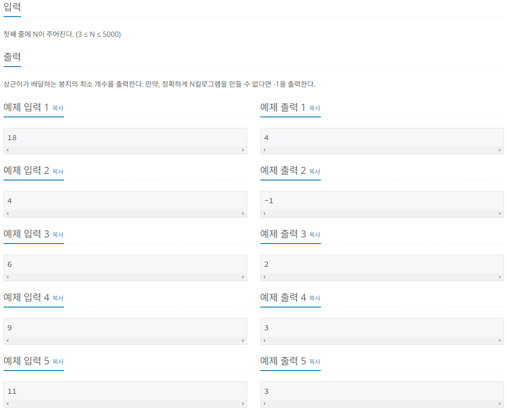

# 1. 문제 정보
문제: 설탕 배달
링크: https://www.acmicpc.net/problem/2839

# 2. 문제 설명
상근이는 요즘 설탕공장에서 설탕을 배달하고 있다. 상근이는 지금 사탕가게에 설탕을 정확하게 N킬로그램을 배달해야 한다. 설탕공장에서 만드는 설탕은 봉지에 담겨져 있다. 봉지는 3킬로그램 봉지와 5킬로그램 봉지가 있다.

상근이는 귀찮기 때문에, 최대한 적은 봉지를 들고 가려고 한다. 예를 들어, 18킬로그램 설탕을 배달해야 할 때, 3킬로그램 봉지 6개를 가져가도 되지만, 5킬로그램 3개와 3킬로그램 1개를 배달하면, 더 적은 개수의 봉지를 배달할 수 있다.

상근이가 설탕을 정확하게 N킬로그램 배달해야 할 때, 봉지 몇 개를 가져가면 되는지 그 수를 구하는 프로그램을 작성하시오.

# 3. 접근 방식
풀이과정: 5킬로그램 봉지가 가장 많이 사용되는 경우를 기준으로 잡고 3킬로그램 봉지가 나누어 떨어지는지를 확인하였다.
예를 들어 29킬로그램을 배달해야한다고 가정했을 때 5킬로그램은 최대 5개

# 4. 회고
- 배운점
- 개선점