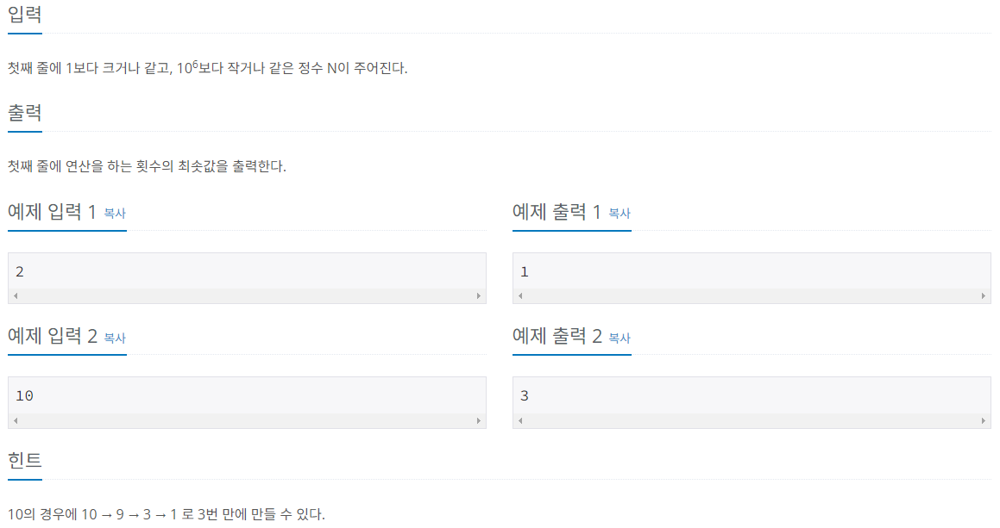

# 1. 문제 정보
문제: 1로 만들기
링크: https://www.acmicpc.net/problem/1463

# 2. 문제 설명
정수 X에 사용할 수 있는 연산은 다음과 같이 세 가지 이다.

1. X가 3으로 나누어 떨어지면, 3으로 나눈다.
2. X가 2로 나누어 떨어지면, 2로 나눈다.
3. 1을 뺀다.
정수 N이 주어졌을 때, 위와 같은 연산 세 개를 적절히 사용해서 1을 만들려고 한다. 연산을 사용하는 횟수의 최솟값을 출력하시오.

# 3. 접근 방식
풀이과정: 5킬로그램 봉지가 가장 많이 사용되는 경우를 기준으로 잡고 3킬로그램 봉지가 나누어 떨어지는지를 확인하였다.
예를 들어 29킬로그램을 배달해야한다고 가정했을 때 5킬로그램은 최대 5개